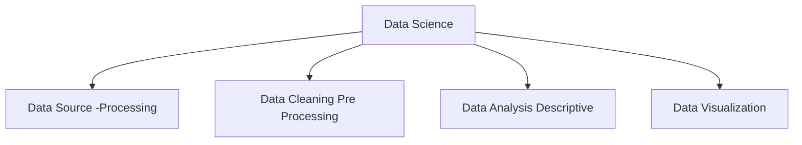

>r script to generate coordinates for a sine wave

```r
count = 360;

str_header = paste("x", "y");
print(str_header, quote="FALSE");

i = 0;
while(i <  360){
	x = i;
	y = sin((x*pi/180));
	str_row = paste(x,y);
	print(str_row, quote=FALSE);
	i = i + 1;

}

```

```bash
rscript sine.r > sineData.txt
```

> in excel import from text/csv


![[Pasted image 20250807170432.png]]

![[Pasted image 20250807150501.png]]

```r
x = c(0:359)
y = sin(x*pi/180)
y = cos(x*pi/180)

plot(x,y,type="l")
```


OR

```r
plot(c(0:359), sin(x*pi/180), type="l")
```

```r
plot(c(0:359))
```


```r
library(readxl)
data_file = file.choose()
sineData = read_xlsx(data_file)
plot(sineData)
```

add cos column to the data

```r
sineData$"z" = cos(sineData$"x" * pi/180);
```

```r
plot(sineData$"x", sineData$"z", type="l")
plot(read.xlsx(data_file));
```

![[Pasted image 20250807152930.png]]

## write to an excel file

> 
```r
install.packages("writexl")
library(writexl)
newFilePath = "D:/college/R/newDataFile.xlsx"
write_xlsx(sineData, newFilePath);
```

