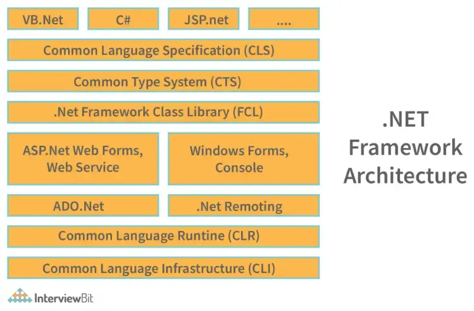

## History and Overview of .NET Framework

1. The .NET Framework was developed by Microsoft in the late 1990s and officially released in 2002 as a platform for building and running Windows applications.
2. Its goals were portability, security, and powerful integration of multiple programming languages, with support for desktop, web, and mobile applications through components like ASP.NET and Windows Forms.
3. The framework provides a managed execution environment, essential libraries, and language interoperability.

## Components and Versions

Key components of the .NET Framework include

1. the Common Language Runtime (CLR) : which manages program execution
2. the Base Class Library (BCL) : a set of reusable classes for common tasks.
3. ASP.NET for web development
4. ADO.NET for data access. 

 Since its initial release, the framework has progressed through major versions, adding support for new APIs, security features, and compatibility for different operating systems.

## Introduction to C sharp

1. C# is a modern, object-oriented language designed by Microsoft to work with the .NET Framework.
2. It aims for simplicity, efficiency, and scalability in application development.

## C# Language Elements

C# provides distinct elements: variables, operators, expressions, statements, classes, methods, and namespaces. These elements are used to build robust and maintainable code.

## Data Types

C# supports two main categories of data types:

- **Value Types**: Store data directly, include primitive types like `int`, `char`, `float`, and structures.
- **Reference Types**: Store pointers to data elsewhere in memory, including `class`, `interface`, `delegate`, and arrays.
## Key Differences

| Aspect               | Value Types                                                                                                                                             | Reference Types                                                                                                                                                                                   |
| -------------------- | ------------------------------------------------------------------------------------------------------------------------------------------------------- | ------------------------------------------------------------------------------------------------------------------------------------------------------------------------------------------------- |
| Storage              | Stored directly on the stack                                                                                                                            | Stores a reference (address) on the stack, but the data is stored on the heap[linkedin+1](https://www.linkedin.com/pulse/value-vs-reference-types-c-roman-fairushyn)                              |
| Data Copying         | Copying creates a new independent copy[learn.microsoft+1](https://learn.microsoft.com/en-us/dotnet/csharp/language-reference/builtin-types/value-types) | Copying copies only the reference; both variables point to the same object[linkedin+1](https://www.linkedin.com/pulse/value-vs-reference-types-c-roman-fairushyn)                                 |
| Types Included       | int, float, bool, char, struct, enum[linkedin+1](https://www.linkedin.com/pulse/value-vs-reference-types-c-roman-fairushyn)                             | class, interface, array, delegate, string[linkedin+1](https://www.linkedin.com/pulse/value-vs-reference-types-c-roman-fairushyn)                                                                  |
| Nullability          | Cannot be null                                                                                                                                          | Can be null (address can be unassigned)[learn.microsoft](https://learn.microsoft.com/en-us/answers/questions/1407356/value-types-and-reference-types-in-c)                                        |
| Behaviour in Methods | Passed by value by default; changes do [learn.microsoft]                                                                                                | Passed by reference by default; changes affect original[linkedin+1](https://www.linkedin.com/pulse/value-vs-reference-types-c-roman-fairushyn)                                                    |
| Example              | int a = 5; int b = a; b = 10; // a remains 5                                                                                                            | `StringBuilder sb1 = new StringBuilder(\"Hi\"); StringBuilder sb2 = sb1; sb2.Append(\"!\"); // sb1: \"Hi!\"`[linkedin](https://www.linkedin.com/pulse/value-vs-reference-types-c-roman-fairushyn) |
## Boxing and Unboxing

- **Boxing**: Converting a value type to a reference type (object).
    
- **Unboxing**: Extracting the value type from the object, reversing boxing.
    

## Enums and Constants

- **Enum**: Set of named constants representing underlying integral types.
    
- **Constant**: Immutable values defined at compile-time using the `const` keyword.
    

## Operators and Control Statements

C# includes mathematical, logical, relational, and assignment operators. Control statements (such as `if`, `switch`, `while`, `for`, and `foreach`) define program flow.

## Working with Arrays and Strings

- **Arrays**: Ordered collections of items with a fixed size and data type.
    
- **Strings**: Immutable sequences of Unicode characters with extensive methods for manipulation.
    

## Parameter Passing

- **Pass by Value**: Sends a copy of a variable.
    
- **Pass by Reference**: Sends a reference to the actual data, allowing modification.
    

## Variable Length Parameters

C# supports variable-length parameters using the `params` keyword, useful for flexible method calls.

---

## Object-Oriented Programming (OOP) Concepts

C# is fundamentally object-oriented, focusing on encapsulation, inheritance, and polymorphism.

- **Object Oriented Concepts**: Include abstraction, encapsulation, inheritance, and polymorphism.
    
- **Indexers and Properties**: Allow objects to be indexed like arrays and encapsulate access to fields, respectively.
    
- **Constructors & Destructors**: Special methods for initializing and cleaning up objects.
    
- **Static Members**: Belong to the class rather than the instance; shared across all objects.
    
- **Inheritance & Polymorphism**: Enables code reuse and method overriding for dynamic behavior.
    
- **Types of Inheritance**: Single, multiple (via interfaces), multilevel, hierarchical, hybrid.
    
- **Constructor in Inheritance**: Controls base and derived object initialization.
    
- **Interface Implementation**: Provides contracts for classes to guarantee certain methods.
    
- **Operator & Method Overloading/Overriding**: Allows custom implementations for operators and method behavior in derived classes.
    
- **Static & Dynamic Binding**: Connects method calls to their implementation at compile or runtime.
    
- **Virtual Methods, Abstract Classes, Sealed Keyword**: Supports extensibility and restricts further inheritance when needed.
    

---

## Exception Handling

- **Exception**: An error that disrupts normal program flow.
    
- **Handling Rules**: Use structured error handling to catch and manage exceptions.
    
- **Exception Classes and Properties**: System.Exception is the base, with properties like Message, StackTrace.
    
- **try, catch, finally**: Core keywords for error handling and cleanup.
    
- **Throwing Exceptions**: Enables custom error signaling using `throw`.
    
- **Custom Exception Classes**: Allows creation of domain-specific exception types for richer error handling.
    

---

## Using I/O Classes

- **Streams**: Foundation for reading/writing text (TextStream) and binary (BinaryStream) data.
    
- **System.IO**: Namespace containing classes for file and directory operations.
    
- **Console I/O Streams**: Handles input/output via console, using `Console.ReadLine()` and `Console.WriteLine()`.
    
- **File System Classes**: File, FileInfo, Directory, DirectoryInfo aid in manipulating files/directories, providing methods for creation, deletion, and enumeration.
    

---

## Delegates, Events, Collections, Generics, Multithreading

- **Types of Delegates**: Single-cast, multi-cast, anonymous methods.
    
- **Events**: Notifies subscribers about changes/tasks; central to UI and async patterns.
    
- **Multicast Events and Lambda Expressions**: Enables multiple listeners and inline function expressions.
    
- **Collections and Generics**: IList, IDictionary, ArrayList, Hashtable, Stack, Queue allow flexible data structures.
    
- **Custom Generic Classes**: Developers can write type-safe, reusable collections.
    
- **Multithreading**: Supports concurrent execution using Thread class, synchronization primitives, and controls for thread priorities and lifecycle operations.
    

---

These foundational topics provide a comprehensive starting point for learning about the .NET Framework and C#, as well as advanced programming concepts including OOP, exception handling, I/O, delegates, collections, generics, and multithreading.